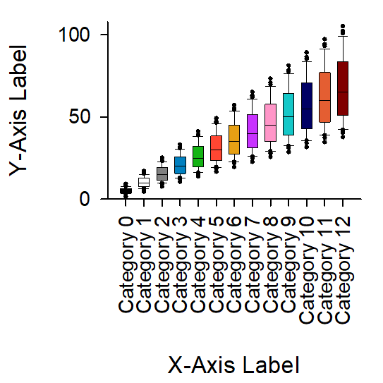

<!-- ---
!-- Timestamp: 2025-04-09 17:52:06
!-- Author: ywatanabe
!-- File: /home/ywatanabe/win/documents/SigMacro/README.md
!-- --- -->

# SigMacro

This package allows users to create publication-ready figures using [SigmaPlot](https://grafiti.com/sigmaplot-v16/) from Python, in a similar manner to matplotlib.

## Gallery
<div style="display: flex; flex-wrap: wrap; justify-content: space-between; max-width: 800px; margin: 0 auto;">
    
    
    
    
    
    
    
    
    
    
    
    
    
    
    
</div>

## Working with GUI


## Prerequisite

 - SigmaPlot License 
 - Windows OS

## How does it work?

#### In SigmaPlot:
1. [ALL-IN-ONE-MACRO](./vba/ALL-IN-ONE-MACRO.vba) embedded in [the SigmaPlot template file](./templates/jnb/template.JNB):
   - Reads graph parameters
   - Plots data

#### Python wrapper (pysigmacro):
1. Sends (i) plotting data and (ii) graphing parameters to SigmaPlot
2. Calls SigmaPlot macro
3. Saves (cropped) figures

In other wards, [csv files in these formats](./templates/csv) can be rendered by the [all-in-one-macro](./vba/ALL-IN-ONE-MACRO.vba). For more details, please refer to [the entry script](./PySigMacro/examples/demo.py) for the above demonstrations )

## Installation & Quick Start

``` powershell
# Install pysigmacro package
cd \path\to\PySigMacro && python.exe -m pip install -e .

# Run demo entry script
python.exe ./PySigMacro/examples/demo.py
```

## TODO
- [ ] Implement simple interface like below

  ``` python
  import pysigmacro as psm
  import pandas as pd

  df = pd.DataFrame(...)

  plotter = psm.Plotter()
  plotter.add("area", df["x", "y"])
  plotter.add("line", df["x", "y", "yerr"])
  plotter.add("box", df["x"])
  plotter.add("scatter", df["x", "y"])
  # plotter.add("boxh", df["y"])
  ...

    ```

## Contact
Yusuke Watanabe (ywatanabe@alumni.u-tokyo.ac.jp)

<!-- EOF -->