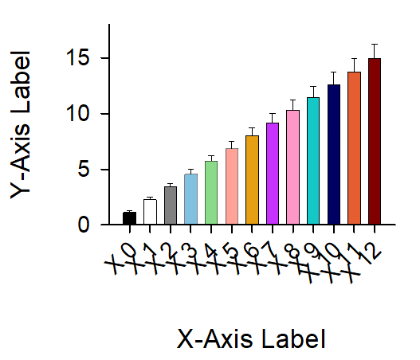
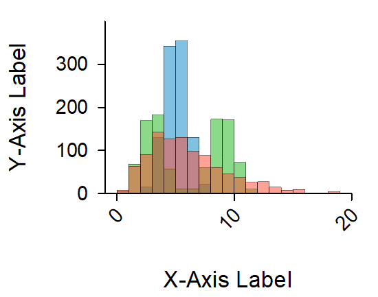
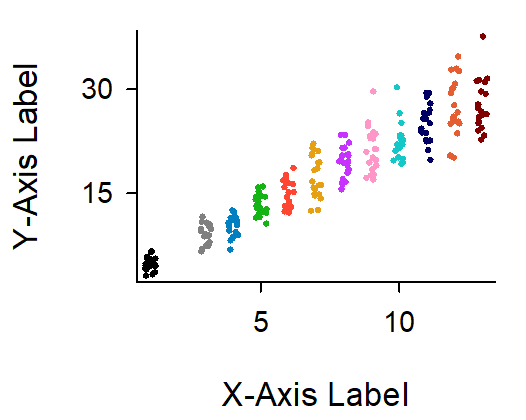
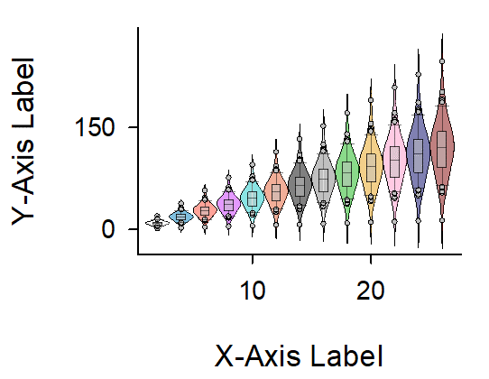

<!-- ---
!-- Timestamp: 2025-04-09 20:59:51
!-- Author: ywatanabe
!-- File: /home/ywatanabe/win/documents/SigMacro/README.md
!-- --- -->

# SigMacro

This package allows users to create publication-ready figures using [SigmaPlot](https://grafiti.com/sigmaplot-v16/) from Python, in a similar manner to matplotlib.

## Gallery
<div style="display: flex; flex-wrap: wrap; justify-content: space-between; max-width: 800px; margin: 0 auto;">
    
    
    
    
    
    
    
    
    
    
    
    
    
    
    
</div>

## Working with GUI


## Prerequisite

 - SigmaPlot License 
 - Windows OS

## How does it work?

#### In SigmaPlot:
1. [ALL-IN-ONE-MACRO](./vba/ALL-IN-ONE-MACRO.vba) embedded in [the SigmaPlot template file](./templates/jnb/template.JNB):
   - Reads graph parameters
   - Plots data

#### Python wrapper (pysigmacro):
1. Sends (i) plotting data and (ii) graphing parameters to SigmaPlot
2. Calls SigmaPlot macro
3. Saves (cropped) figures

In other wards, [csv files in these formats](./templates/csv) can be rendered by the [all-in-one-macro](./vba/ALL-IN-ONE-MACRO.vba). For more details, please refer to [the entry script](./PySigMacro/examples/demo.py) for the above demonstrations )

## Installation

``` powershell
# Install pysigmacro package
cd \path\to\PySigMacro && python.exe -m pip install -e .

# # Run demo entry script
# python.exe ./PySigMacro/examples/demo.py
```

## Quick Start

Using `pysigmacro.Plotter` class, figures can be created like this:

``` python
import os

# Environmental variables
VARIABLE_DICT = {
    "SIGMACRO_JNB_PATH": rf"C:\Users\{os.getlogin()}\Documents\SigMacro\SigMacro.JNB",
    "SIGMACRO_TEMPLATES_DIR": rf"C:\Users\{os.getlogin()}\Documents\SigMacro\templates",
    "SIGMAPLOT_BIN_PATH_WIN": rf"C:\Program Files (x86)\SigmaPlot\SPW16\Spw.exe",
}
for k, v in VARIABLE_DICT.items():
    if k not in os.environ:
        os.environ[k] = v

import pysigmacro as psm
import pandas as pd
import numpy as np

def main():
    # 1. Create sample data (replace with your actual data)
    line_dict = {
        'x': np.linspace(0, 10, 20),
        'y': np.sin(np.linspace(0, 10, 20)) * 2 + 5,
        'bgra': psm.utils.get_BGRA("blue", alpha=1.),
    }

    scatter_dict = {
        'x': np.random.rand(15) * 10,
        'y': np.random.rand(15) * 10 + 2,
        'bgra': psm.utils.get_BGRA("green", alpha=1.),
    }

    bar_dict = {
        'x': [i+1 for i in range(5)],
        'y': np.random.rand(5) * 8 + 1,
        'yerr': np.random.rand(5) * 1 + 0.5,
        'bgra': psm.utils.get_BGRA("red", alpha=0.5),
    }


    # 2. Instantiate the Plotter
    plotter = psm.Plotter()

    # 3. Add plot layers
    # Add a line plot using df_line
    plotter.add('line', line_dict)

    # Add a scatter plot using df_scatter
    plotter.add('scatter', scatter_dict)

    # Example: Add bar plot - Note: Bar plots often need specific data format
    # For the demo structure, categorical 'x' and numeric 'y'/'yerr' are common
    plotter.add('bar', bar_dict) # Uncomment if you want to include a bar plot

    # 4. Set visual parameters (optional)
    plotter.set_params(
        xlabel = "X-Axis Label",
        xrot = 45,
        xmm = 40,
        xscale = "linear",
        xmin = "auto",
        xmax = "auto",
        xticks = ["auto"],
        ylabel = "Y-Axis Label",
        yrot = 0,
        ymm = 40 * 0.7,
        yscale = "linear",
        ymin = "auto",
        ymax = "auto",
        yticks = ["auto"],
    )

    # 5. Render the plot
    # This will create 'my_figure.jnb', 'my_figure.tif', etc. in the specified directory
    output_directory = "." # rf"C:\Users\{os.getlogin()}\Downloads" # CHANGE THIS
    base_filename = "demo_plot_using_plotter"

    try:
        jnb_path = plotter.render(output_dir=output_directory, filename_base=base_filename)
        print(f"SigmaPlot JNB generated at: {jnb_path}")
    except Exception as e:
        print(f"An error occurred during rendering: {e}")

if __name__ == '__main__':
    main()
```

Above code will create this figure:


## How to add your own plotting routine
To add or edit this package, you might want to update these files:
- [`./PySigMacro/src/pysigmacro/data/_create_graph_wizard_params.py`](./PySigMacro/src/pysigmacro/data/_create_graph_wizard_params.py)
- [`./PySigMacro/src/pysigmacro/demo/_gen_data.py`](./PySigMacro/src/pysigmacro/demo/_gen_data.py)
- [`./PySigMacro/src/pysigmacro/demo/_gen_visual_params.py`](./PySigMacro/src/pysigmacro/demo/_gen_visual_params.py)
- [`./PySigMacro/examples/demo.py`](./PySigMacro/examples/demo.py)
- [`./PySigMacro/src/pysigmacro/const/_PLOT_TYPES.py`](./PySigMacro/src/pysigmacro/const/_PLOT_TYPES.py)
- [`./PySigMacro/src/pysigmacro/demo/_update_visual_params_with_nice_ticks.py`](./PySigMacro/src/pysigmacro/demo/_update_visual_params_with_nice_ticks.py)
- [`./vba/ALL-IN-ONE-MACRO.vba`](./vba/ALL-IN-ONE-MACRO.vba)
- [`./templates/template.jnb`](./templates/template.jnb) (embed the ALL-IN-ONE-MACRO.vba contents as all-in-one-macro)

## Contact
Yusuke Watanabe (ywatanabe@alumni.u-tokyo.ac.jp)

<!-- EOF -->